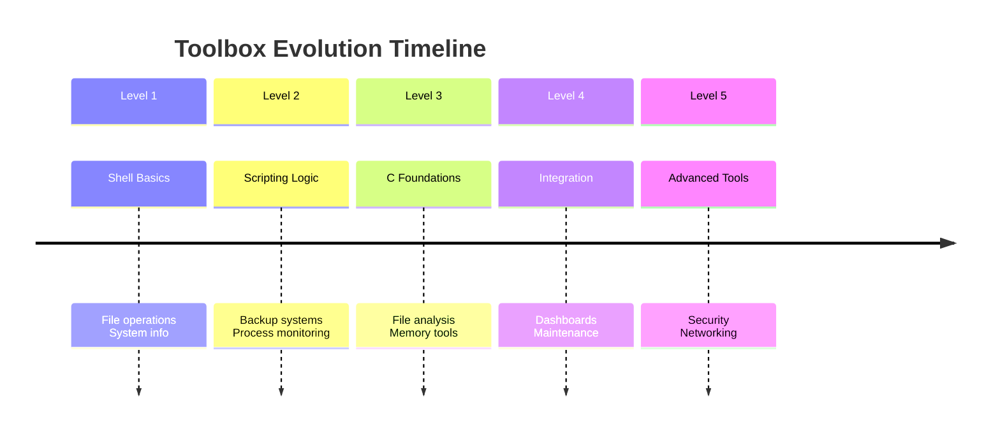

# Unix Toolbox Evolution 🧰→🚀

> **From simple scripts to powerful system tools** - A hands-on journey through Unix/Linux system programming and automation, evolving complexity with each project.

[](https://opensource.org/licenses/MIT)


## 📖 Overview

This repository documents my evolution from writing basic Bash one-liners to developing sophisticated system utilities in C. Each level builds upon previous knowledge, creating a comprehensive toolbox for Unix/Linux system management.

## 🗺️ Evolution Path

### **Level 1: Shell Basics**
*Basic automation and file management*
- Simple file operations
- System information scripts
- Basic text processing

### **Level 2: Scripting Logic**
*Useful utilities with error handling*
- Backup systems
- Process monitoring
- Configuration management

### **Level 3: C Foundations**
*System programming introduction*
- File analysis tools
- Process information
- Memory usage monitors

### **Level 4: Integration**
*Combining Bash and C for efficiency*
- Performance monitors
- System health dashboards
- Automated maintenance tools

### **Level 5: Advanced Toolbox**
*Production-ready system tools*
- Security scanners
- Network monitors
- Custom system utilities

## 📁 Repository Structure

```
unix-toolbox-evolution/
│
├── level-1-shell-basics/          # Beginner Bash scripts
│   ├── file-cleaner/             # Simple temp file cleaner
│   ├── system-info/              # Basic system information
│   ├── text-processor/           # AWK/SED examples
│   └── README.md                 # Level-specific documentation
│
├── level-2-scripting-logic/      # Intermediate utilities
│   ├── backup-manager/           # Automated backup system
│   ├── process-watcher/          # Process monitoring tool
│   ├── config-manager/           # Dotfile management
│   └── README.md
│
├── level-3-c-foundations/        # C system programming
│   ├── file-analyzer/            # File statistics in C
│   ├── memory-monitor/           # RAM usage tool
│   ├── process-lister/           # ps-like utility
│   └── README.md
│
├── level-4-integration/          # Bash + C projects
│   ├── system-dashboard/         # Combined monitoring tool
│   ├── performance-logger/       # System metrics collector
│   ├── auto-maintenance/         # Smart cleanup system
│   └── README.md
│
├── level-5-advanced-toolbox/     # Complex system tools
│   ├── security-scanner/         # File integrity checker
│   ├── network-monitor/          # Connection watcher
│   ├── custom-commands/          # Enhanced Unix utilities
│   └── README.md
│
├── playground/                   # Experiments and tests
├── docs/                         # Learning notes and references
├── templates/                    # Starter templates
└── .evolution-log               # Personal progress tracker
```

## 🚀 Getting Started

### Quick Start
```bash
# Clone the repository
git clone https://github.com/yourusername/unix-toolbox-evolution.git
cd unix-toolbox-evolution

# Start with Level 1
cd level-1-shell-basics/file-cleaner
./cleanmytemp.sh --help

# Or jump to any level
cd level-3-c-foundations/file-analyzer
make && ./analyze /path/to/file
```

### Prerequisites
- **Linux/macOS/WSL** (Unix-like environment)
- **Bash** 4.0 or higher
- **GCC/Clang** for C projects (Level 3+)
- Basic terminal familiarity

## 🎓 What I'm Learning

### **Core Skills**
- ✅ Unix philosophy and tool design
- ✅ Bash scripting and automation
- ✅ C system programming
- ✅ Error handling and robustness
- ✅ Performance optimization

### **System Concepts**
- ✅ Filesystem and permissions
- ✅ Process management
- ✅ Memory and resource monitoring
- ✅ Networking basics
- ✅ Security principles

### **Development Practices**
- ✅ Git and version control
- ✅ Documentation writing
- ✅ Testing and debugging
- ✅ Code organization
- ✅ Open source contribution

## 🛠️ Tool Evolution Examples

### **Example 1: File Cleaner Evolution**
```bash
# Level 1: Basic cleaner
find /tmp -type f -mtime +7 -delete

# Level 2: With logging and safety
./cleaner.sh --dry-run --log /var/log/cleanup.log

# Level 3: C version for speed
./fastclean --parallel --exclude "*.important"

# Level 5: Intelligent cleaner
./smartclean --learn --auto --notify
```

### **Example 2: System Monitor Evolution**
```bash
# Level 1: Simple Bash
top -n 1 | grep "Cpu"

# Level 3: C program for efficiency
./cpumon --interval 1 --format json

# Level 4: Integrated dashboard
./sysdash --web --port 8080

# Level 5: Alerting system
./monitor --threshold 80% --alert email --action "scale-services"
```

## 📚 Learning Resources

Each level contains:
- **Project README** with objectives and learnings
- **Code comments** explaining key concepts
- **Challenge exercises** to extend functionality
- **Further reading** links for deep dives

## 🎯 How to Use This Repository

### **For Learners:**
1. Start at Level 1, even if you know basics (reinforces fundamentals)
2. Complete all projects in a level before moving to next
3. Modify and extend each project with your own features
4. Document your learnings in the `.evolution-log`

### **For Developers:**
- Use as reference for Unix tool development
- Copy templates for new projects
- Study the progression patterns
- Contribute your own tools or improvements

## 🔄 Evolution Principles

1. **Start Simple**: Minimum viable tool first
2. **Iterate**: Add features gradually
3. **Refactor**: Improve code quality at each stage
4. **Document**: Explain the "why" not just the "how"
5. **Share**: Make tools useful for others

## 🤝 Contributing

This is a personal learning journey, but contributions are welcome! See [CONTRIBUTING.md](docs/CONTRIBUTING.md) for guidelines.

## 📝 License

This project is licensed under the MIT License - see the [LICENSE](LICENSE) file for details.

## 🌟 Evolution Status



---

**"The Unix philosophy is to write programs that do one thing and do it well."** – This repository is my journey to embody that philosophy through practical, evolving tools.